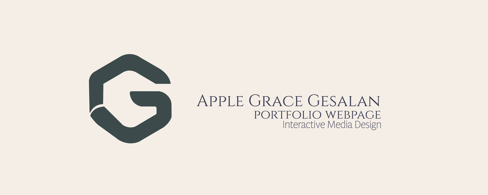

# Apple Grace Gesalan Portfolio

Welcome to my portfolio website! This will serve as a window into my creative world, offering insights into my background,  creative journey, and showcasing my best work. The website consists of three pages:

Homepage
The homepage provides a warm introduction to my portfolio. It features a brief yet informative overview of my background, artistic passions, and creative endeavors. This section acts as a gateway to explore my work further.

About Me Page
On the About Me page, delve deeper into the intricacies of my creative persona, unveiling the experiences and influences that shape my artistic vision. This section offers a personal narrative that goes beyond the surface, providing insights into the stories behind my creations and the evolving nature of my artistic journey. Additionally, you'll discover a curated project reel, serving as a dynamic showcase of my finest works, allowing you to witness the diverse range of my creative expressions in one captivating visual experience. 

Contact Page
Staying connected with my audience is essential to me, and that's why I've included a Contact page. Whether you have questions, feedback, or collaboration ideas, I'm always eager to engage in meaningful conversations.

Additionally, I maintain a Print Shop where you can explore and purchase some of my artwork, bringing a piece of my creative world into your own space.

Thank you for visiting my portfolio website, and I hope you enjoy your exploration. 

## Contributing
1. Fork it!
2. Create your feature branch: git checkout -b my-new-feature
3. Commit your changes: git commit -am 'Add some feature'
4. Push to the branch: git push origin my-new-feature
5. Submit a pull request :D

## Credits

Apple Grace Gesalan

## License

MIT